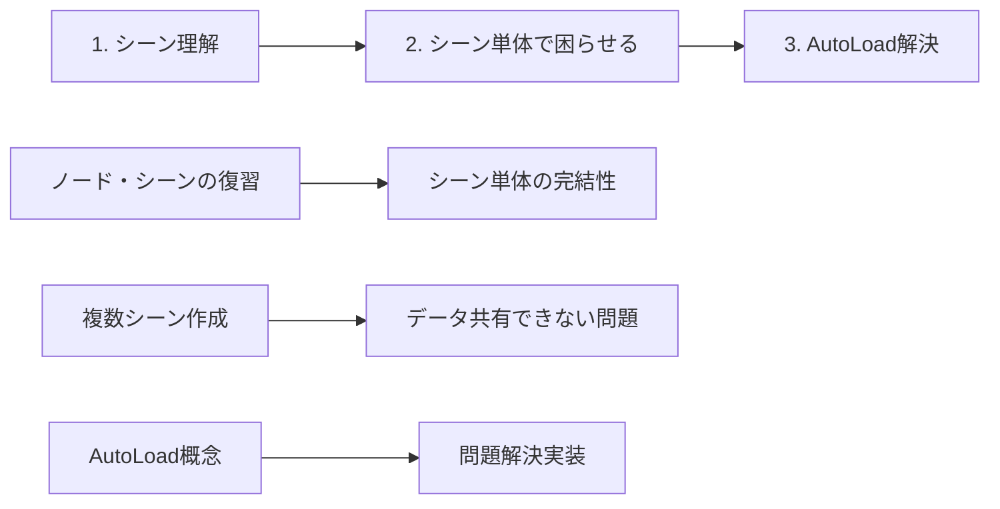

# 📝 ブログ構成：シーン理解 → 困らせる → AutoLoad解決

## 🎯 3段階アプローチ



## 📖 段階1：シーンを理解してもらう

### **シーンの本質を再確認**

```gdscript
# シーンは「完全に独立したプログラム」
# TitleScreen.tscn
extends Control

var player_name: String = ""
var selected_difficulty: String = "Easy"

func _ready():
    print("タイトル画面が開始されました")
    # この画面だけで完結している

func _on_start_pressed():
    player_name = name_input.text
    print("プレイヤー名: ", player_name)  # ここでは使える
    # この画面内では何でもできる
```

**重要なポイント：**
- ✅ シーン内の変数・関数は自由に使える
- ✅ シーン内でデータの保存・取得も自由
- ✅ シーン単体では何の問題もない

### **「シーンは独立した世界」であることを体感**

```gdscript
# 読者に実際に作ってもらう
# SimpleCounter.tscn (カウンターアプリ)

extends Control

var count: int = 0

func _on_plus_pressed():
    count += 1
    update_display()

func _on_minus_pressed():  
    count -= 1
    update_display()

func update_display():
    count_label.text = str(count)

# この時点では何も問題ない！完璧に動く！
```

## 💥 段階2：シーン単体で困らせる

### **問題シナリオ：「プレイヤー情報を覚えていてほしい」**

```gdscript
# 読者に実際に体験してもらう困った状況

# TitleScreen.gd
extends Control
var player_name: String = ""

func _on_start_pressed():
    player_name = name_input.text
    print("こんにちは ", player_name, " さん！")  # ここでは表示できる
    
    # ゲーム画面に移動
    get_tree().change_scene_to_file("res://GameScreen.tscn")
    # ↑ この瞬間に player_name は消滅する
```

```gdscript
# GameScreen.gd  
extends Control

func _ready():
    # あれ？プレイヤー名が分からない！
    welcome_label.text = "ようこそ、" + ??? + "さん！"
    #                                ^^^ 
    #                            ここに何を入れる？
    
    # player_name変数は存在しない
    # TitleScreenのデータにアクセスできない
    print("プレイヤー名を知りたいのに...")  # 困った！
```

### **さらに困らせる：設定画面でも同様の問題**

```gdscript
# SettingsScreen.gd
extends Control

var master_volume: float = 0.8
var sfx_volume: float = 0.7

func _on_save_pressed():
    print("設定を保存しました")
    # メニューに戻る
    get_tree().change_scene_to_file("res://MainMenu.tscn")
    # ↑ この瞬間に設定値が消滅
```

```gdscript
# MainMenu.gd
extends Control

func _ready():
    # あれ？保存した設定値が使えない！
    AudioServer.set_bus_volume_db(0, ???)  # 音量が分からない
    #                                ^^^
    #                            設定値にアクセスできない
```

### **問題の明確化**

```markdown
# 読者が直面する問題一覧

❌ プレイヤー名をゲーム中に表示できない
❌ 設定した音量が他の画面で使えない  
❌ スコアをタイトル画面で表示できない
❌ 選択したキャラクターが他画面で分からない
❌ ログイン情報が画面移動で消える

# この時点で読者は完全に困っている
「Godotって不便じゃない？」と思っているはず
```

## ✨ 段階3：AutoLoad で問題解決

### **「魔法のような解決策」として登場**

```gdscript
# PlayerData.gd (AutoLoadに登録)
extends Node

# グローバル変数！どこからでもアクセス可能
var player_name: String = ""
var score: int = 0
var selected_character: int = 1

# グローバル関数！どこからでも呼び出し可能
func add_score(points: int):
    score += points
    print("スコア更新: ", score)
```

### **問題解決を実感**

```gdscript
# TitleScreen.gd（修正版）
extends Control

func _on_start_pressed():
    PlayerData.player_name = name_input.text  # グローバルに保存
    print("プレイヤー名を保存: ", PlayerData.player_name)
    
    get_tree().change_scene_to_file("res://GameScreen.tscn")
    # データは消えない！
```

```gdscript
# GameScreen.gd（修正版）
extends Control

func _ready():
    # 魔法のようにデータが使える！
    welcome_label.text = "ようこそ、" + PlayerData.player_name + "さん！"
    score_label.text = "スコア: " + str(PlayerData.score)
    
    print("やった！プレイヤー名が使えた: ", PlayerData.player_name)
```

### **「これぞAutoLoadの威力！」を体感**

```gdscript
# どのシーンからでも
PlayerData.player_name        # 取得可能
PlayerData.add_score(100)     # 関数呼び出し可能
PlayerData.score              # スコア参照可能

# 設定も同様
Settings.master_volume        # 音量設定
Settings.save_settings()      # 設定保存
```

## 🎯 この構成の学習効果

### **段階的な「気づき」**
1. **シーン理解**: 「シーンって便利！」
2. **問題体験**: 「あれ？不便じゃない？」  
3. **解決実感**: 「AutoLoadすごい！便利！」

### **感情の変化**
```
😊 シーン楽しい
　↓
😰 あれ？データが使えない...
　↓  
😫 これ、毎回どうすればいいの？
　↓
🤔 何か解決方法ないかな？
　↓
✨ AutoLoad発見！
　↓
🎉 すごい！これで解決！
```

## 📝 ブログ記事での実装方法

### **実際にダウンロードしてもらうサンプル**

```
Phase1_SingleScene.zip      # 単一シーンで完結
├── Counter.tscn           # 問題ないカウンター

Phase2_MultiScene_Problem.zip  # 複数シーンで問題発生
├── TitleScreen.tscn       # 名前入力
├── GameScreen.tscn        # 名前表示したいができない  
└── SettingsScreen.tscn    # 設定保存したいができない

Phase3_AutoLoad_Solution.zip   # AutoLoadで解決
├── autoload/PlayerData.gd # AutoLoad追加
├── TitleScreen.tscn       # 修正版
├── GameScreen.tscn        # 修正版
└── SettingsScreen.tscn    # 修正版
```

この3段階構成で、読者は確実にAutoLoadの価値を理解できますね！

各段階でどのくらいの詳しさで説明したいか、具体的な実装方法など、さらに詳細を決めていきましょうか？