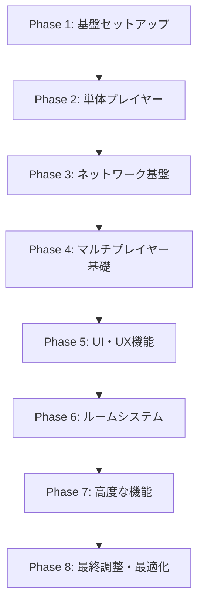

# 🚀 3Dマルチプレイヤーゲーム 開発フロー

## 📊 全体開発スケジュール（推奨）



## 🏗️ Phase 1: 基盤セットアップ（1-2日）

### **🎯 目標**
プロジェクトの土台を作り、開発環境を整備

### **📝 実装タスク**
1. **Godotプロジェクト作成**
   - プロジェクト設定
   - フォルダ構造作成
   - `.gitignore` 設定

2. **AutoLoad設定**
   - `Game.gd` - 基本的なゲーム状態管理
   - `Settings.gd` - 設定システム
   - `EventBus.gd` - グローバルイベント

3. **基本設定ファイル**
   - `data/config/server_config.json`
   - `scripts/core/Constants.gd`
   - `scripts/core/GameTypes.gd`

### **✅ 完成条件**
- Godotプロジェクトが正常起動
- AutoLoadが動作
- 基本的な設定保存・読込が動作

### **🧪 テスト方法**
```gdscript
# Game.gd で基本テスト
func _ready():
    print("Game singleton initialized")
    Settings.save_setting("test_key", "test_value")
    var loaded = Settings.load_setting("test_key")
    print("Settings test: ", loaded)
```

---

## 👤 Phase 2: 単体プレイヤー（2-3日）

### **🎯 目標**  
シングルプレイヤーで基本的な3D移動とアニメーションを実装

### **📝 実装タスク**
1. **プレイヤーシーン作成**
   - `scenes/player/Player.tscn`
   - `CharacterBody3D` + `MeshInstance3D` + `CollisionShape3D`
   - 3人称カメラシステム

2. **移動システム**
   - `scripts/player/PlayerController.gd`
   - WASD移動、マウスカメラ制御
   - 重力・コリジョン処理

3. **アニメーションシステム**
   - `scripts/player/AnimationController.gd`
   - `scripts/core/AnimationStates.gd`
   - 待機・歩行・走行の自動切り替え

4. **テスト環境**
   - `scenes/worlds/TestWorld.tscn`
   - 基本的な地形とオブジェクト

### **✅ 完成条件**
- プレイヤーがスムーズに移動
- アニメーションが適切に切り替わる
- カメラが追従動作
- 基本的なアクション（ジャンプ等）動作

### **🧪 テスト方法**
- WASDでの移動確認
- マウスでのカメラ回転確認  
- アニメーション状態変化確認
- 地形との当たり判定確認

---

## 🌐 Phase 3: ネットワーク基盤（3-4日）

### **🎯 目標**
サーバーとの通信基盤を構築（まだマルチプレイヤーではない）

### **📝 実装タスク**
1. **ネットワークシングルトン**
   - `autoload/Net.gd`
   - `scripts/network/GraphQLClient.gd`
   - `scripts/network/WebSocketClient.gd`

2. **認証システム**
   - `scripts/network/AuthManager.gd`
   - ログイン画面（`scenes/ui/screens/LoginScreen.tscn`）
   - JWT トークン管理

3. **キャラクター選択**
   - `scenes/ui/screens/CharacterSelect.tscn`
   - `scripts/player/CharacterSelector.gd`
   - キャラクターデータのサーバー取得

4. **基本データ同期**
   - ユーザー情報の取得・保存
   - サーバー接続状態管理

### **✅ 完成条件**
- サーバーにログイン可能
- キャラクター選択が動作
- GraphQL通信が成功
- WebSocket接続が確立（メッセージ送信はまだ不要）

### **🧪 テスト方法**
```gdscript
# 認証テスト
Net.login("test_user", "test_password", _on_login_result)

# GraphQLテスト  
Net.graphql_query("query { users { username } }", {}, _on_query_result)

# WebSocket接続テスト
Net.connect_websocket()
```

---

## 👥 Phase 4: マルチプレイヤー基礎（3-4日）

### **🎯 目標**
複数プレイヤーの基本的な同期を実現

### **📝 実装タスク**
1. **リモートプレイヤーシステム**
   - `scenes/player/RemotePlayer.tscn`
   - `scripts/player/PlayerSync.gd`
   - 他プレイヤーの位置・アニメーション同期

2. **プレイヤー管理システム**
   - プレイヤーのスポーン・デスポーン
   - プレイヤー一覧管理
   - 名前表示システム

3. **基本同期システム**
   - 位置情報の送受信
   - アニメーション状態同期
   - 補間・予測処理

4. **テスト用パブリックルーム**
   - `scenes/worlds/MainTown.tscn`
   - 全プレイヤーが入る共通エリア

### **✅ 完成条件**
- 複数クライアントで同じ空間にいる
- 他プレイヤーの移動が見える
- アニメーションが同期
- 名前が表示される

### **🧪 テスト方法**
- 2つのクライアントを同時起動
- 一方で移動し、もう一方で確認
- ネットワーク切断・再接続テスト

---

## 🎨 Phase 5: UI・UX機能（2-3日）

### **🎯 目標**
基本的なゲーム内UIとユーザー体験を整備

### **📝 実装タスク**
1. **チャットシステム**
   - `autoload/Chat.gd`
   - `scenes/ui/hud/ChatPanel.tscn`
   - リアルタイムメッセージング

2. **メインHUD**
   - `scenes/ui/hud/MainHUD.tscn`
   - プレイヤー情報表示
   - 基本的な操作UI

3. **設定画面**
   - `scenes/ui/screens/SettingsScreen.tscn`
   - 音量・画質・操作設定
   - 設定の保存・復元

4. **通知システム**
   - 接続状態表示
   - エラーメッセージ
   - システム通知

### **✅ 完成条件**
- チャットでメッセージ送受信
- 設定変更が反映・保存
- UI操作がスムーズ
- エラー表示が適切

### **🧪 テスト方法**
- チャットメッセージの送受信
- 設定変更後の再起動確認
- 長時間利用でのUI安定性

---

## 🏠 Phase 6: ルームシステム（3-4日）

### **🎯 目標**
プライベートルーム機能を実装

### **📝 実装タスク**
1. **ルーム管理システム**
   - `autoload/Rooms.gd`
   - `scripts/rooms/RoomManager.gd`
   - ルーム作成・削除・参加

2. **ルーム関連UI**
   - `scenes/ui/hud/RoomPanel.tscn`
   - `scenes/ui/dialogs/CreateRoomDialog.tscn`
   - ルーム一覧・検索

3. **招待システム**
   - プレイヤー検索
   - 招待送信・受信
   - 権限管理

4. **プライベートルーム**
   - `scenes/worlds/private_rooms/`
   - ルーム固有の同期
   - メンバー管理

### **✅ 完成条件**
- ルーム作成・入室が動作
- 招待システムが機能
- ルーム内でのみ同期
- 権限管理が適切

### **🧪 テスト方法**
- ルーム作成→招待→参加のフロー
- 複数ルーム間の移動
- 権限によるアクセス制限確認

---

## 🎓 Phase 7: 高度な機能（2-3日）

### **🎯 目標**
研修システム連携とその他の高度な機能

### **📝 実装タスク**
1. **研修システム連携**
   - `scripts/training/TrainingManager.gd`
   - `scenes/ui/hud/TrainingMenu.tscn`
   - 外部ブラウザ連携

2. **マップシステム**
   - 複数マップ間の移動
   - `scenes/worlds/ForestArea.tscn`
   - `scenes/worlds/BeachArea.tscn`

3. **追加機能**
   - プレイヤーアクション（手振り、ダンス等）
   - チャット履歴
   - フレンド機能（オプション）

### **✅ 完成条件**
- 研修システムが動作
- マップ移動がスムーズ
- 追加機能が安定動作

---

## ⚡ Phase 8: 最終調整・最適化（1-2日）

### **🎯 目標**
パフォーマンス最適化と品質向上

### **📝 実装タスク**
1. **パフォーマンス最適化**
   - ネットワーク送信頻度調整
   - メモリ使用量最適化
   - フレームレート安定化

2. **品質改善**
   - バグ修正
   - UI/UX改善
   - エラーハンドリング強化

3. **最終テスト**
   - 長時間稼働テスト
   - 多人数接続テスト
   - 様々な環境でのテスト

## 📝 各フェーズでの推奨作業時間

| Phase | 内容 | 推定時間 | 累計時間 |
|-------|------|----------|----------|
| Phase 1 | 基盤セットアップ | 1-2日 | 1-2日 |
| Phase 2 | 単体プレイヤー | 2-3日 | 3-5日 |
| Phase 3 | ネットワーク基盤 | 3-4日 | 6-9日 |
| Phase 4 | マルチプレイヤー基礎 | 3-4日 | 9-13日 |
| Phase 5 | UI・UX機能 | 2-3日 | 11-16日 |
| Phase 6 | ルームシステム | 3-4日 | 14-20日 |
| Phase 7 | 高度な機能 | 2-3日 | 16-23日 |
| Phase 8 | 最終調整 | 1-2日 | 17-25日 |

**総開発期間: 約3-4週間**

## 🎯 重要な開発原則

### **段階的開発**
- 各フェーズを完全に完成させてから次へ
- 動作確認を必ず行う
- 問題があれば前のフェーズに戻る

### **早期テスト**
- 各機能実装後すぐにテスト
- ネットワーク機能は複数クライアントでテスト
- エラーケースも必ず確認

### **リスク管理**
- ネットワーク関連（Phase 3-4）は重点的に
- パフォーマンステストを定期実行
- バックアップを定期取得

## 🚀 今すぐ始められる最初のステップ

1. **Godotプロジェクト作成**
2. **フォルダ構造セットアップ**  
3. **Git初期化**
4. **基本的なAutoLoad作成**

準備はOKですか？どのフェーズから詳細を知りたいでしょうか？